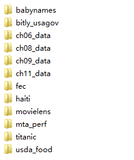

# 利用Python进行数据分析（中文第一版）

​		通过对《利用Python进行数据分析》这本中文书的学习，了解和掌握了很多python相关知识，将自己编写的脚本和数据集附上。

​		由于我用的是python3.6版本，用书中有些地方会报错，所以，我的代码中会有相关修改，保证运行成功！

## 环境说明

> 系统：Win10
>
> python版本：3.6

## 数据集说明

​	数据集多集中在‘datasets.rar’压缩包中，具体包括以下数据集：

## 具体章节

​		主要包括以下代码，[具体脚本链接点这里](https://github.com/haibiyu/Python-for-Data-Analysis-Chinese-First-Edition-)

- 第2章：引言

- 第3章：python基础

- 第4章：numpy基础

- 第5章：pandas入门

- 第6章：数据加载、存储和文件格式

- 第7章：数据规整化：清理 转换 合并  重塑

- 第8章：绘图和可视化

- 第9章：数据集合与分组运算

- 第10章：时间序列

- 第11章：金融和经济数据应用

- 第12章：numpy高级应用 

- 附录：python语言精要

 如果本文对你有帮助，记得“三连击”~ 

## 参考链接

[《利用python进行数据分析》（含数据集+脚本）github链接](https://github.com/haibiyu/Python-for-Data-Analysis-Chinese-First-Edition-)

[英文版git链接](https://github.com/wesm/pydata-book)

